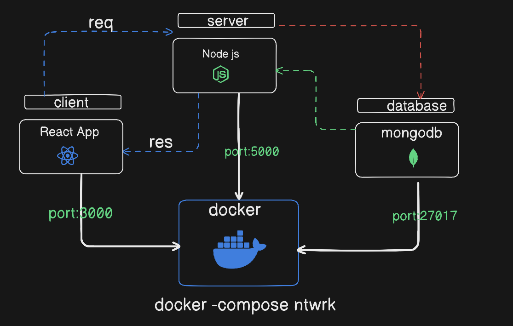

# Multi-Container Docker Application

## Overview
This project deploys a **full-stack application** with three services:

- **Client:** React frontend
- **Server:** Node.js backend
- **Database:** MongoDB

All services are orchestrated using **Docker Compose**, providing:

- Container networking for inter-service communication
- Persistent storage via volumes
- Centralized logging
- Easy deployment with one command

---

## Services

### 1. Client (React)
- **Image:** Built from local `Dockerfile` in `client/`
- **Ports:** `3000:3000`
- **Dependencies:** Connects to `server` via Docker network
- **Volumes (optional):** For development hot-reload
- **Logging:** `docker compose logs client`

---

### 2. Server (Node.js)
- **Image:** Built from local `Dockerfile` in `server/`
- **Ports:** `5000:5000`
- **Dependencies:** Connects to `mongo` via Docker network
- **Environment Variables:**  
  ```env
  MONGO_URI=mongodb://mongo:27017/mydb
  PORT=5000

---

### 3. MongoDB 
- **Image** Official mongo image 
- Ports: 27017:27017 (optional for host access)
- Volumes: Persistent storage

```yaml
volumes : 
  - mongo-data:/data/db
```
- Networking: Accessible by server at mongo:27017

- Logging: docker compose logs mongo

---

### 3. Networking

- All services are on the default Docker Compose network

- Services communicate via container names:

- Server → MongoDB: mongo:27017
---

### 4. Volumes

- mongo-data → persists MongoDB data across restarts
---

### Deployment

- Run all services with:
```bash 
docker compose up --d
```
- -d → detached mode

- View logs with:

```bash
docker compose logs -f
```
----

### Summary Diagram 
-  