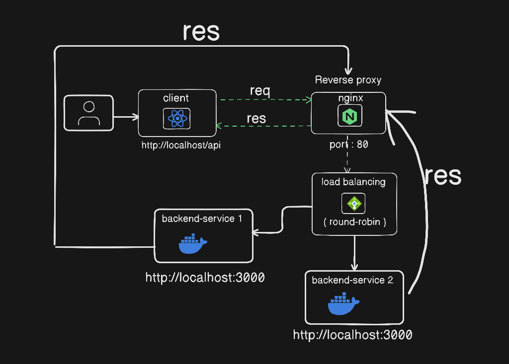

# reverse-proxy-load-balancing

This project demonstrates how to configure an NGINX reverse proxy with round-robin load balancing between two backend service instances, all running inside Docker containers.

---

## Project Structure

### Backend Service Directory (`backend/`)

1. **Dockerfile**: Contains the instructions to build the Docker image for the backend service.

2. **app.js**: A simple Node.js Express application that listens on port `3000` and responds to API requests.
3. **package.json**: Defines the Node.js dependencies for the backend service, like `express`.

### NGINX Configuration (`nginx.conf`)

- Defines the reverse proxy and load balancing configuration for NGINX.
- The reverse proxy is configured to forward requests to two instances of the backend service using **round-robin load balancing**.

### Docker Compose Configuration (`docker-compose.yml`)

- Defines the setup for multiple services:
  - **Two backend instances** (`backend-service-1` and `backend-service-2`).
  - **NGINX reverse proxy** (`nginx`).


---

## Setup Instructions

1. **Clone the repository**:
   Clone the repository containing the Dockerfile, backend code, NGINX configuration, and Docker Compose file.

2. **Build and Start the Containers**:
   Run the following command to build and start the containers:

   ```bash
   docker-compose up --build
   ```
3. **Test the load balancing**
  ```bash
     http://localhost/api
   ```

-----


### System Diagram 
