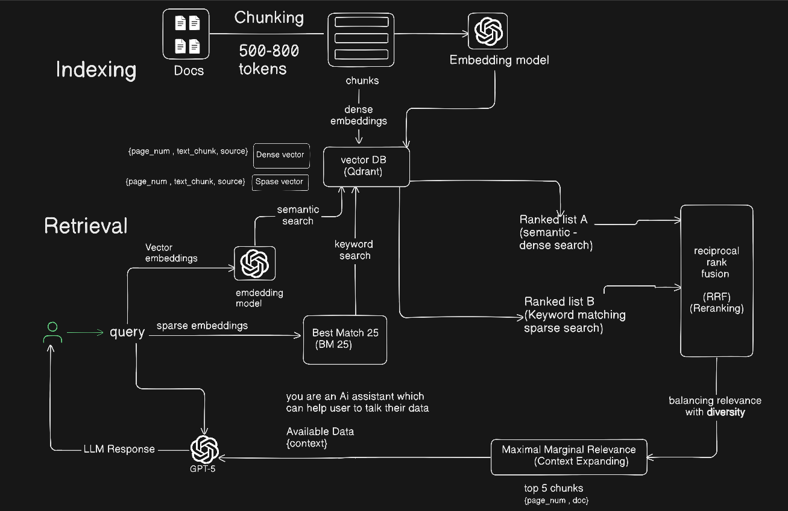

### ADVANCED RAG ARCHITECTURE
----

---

### HYBRID SEARCH

- Hybrid search combines two distinct retrieval methods to leverage their complementary strengths:


### Dense Vector Search (Semantic): 
- Understands the meaning and intent behind a query. Excellent for conceptual matches.


### Example Query: 
- “I want a stomach-friendly pain reliever.”


### What it finds: 
- Documents discussing “gentle on digestion” or “reduces gastric upset,” even if those exact words aren’t used.


### Sparse / Lexical Search (Keyword): 
- Matches exact keywords and terms. Excellent for precise, technical, or named entity queries.


### Example Query: 
- “acetaminophen dosage for adults”

### What it finds: 
- Documents that contain the exact terms “acetaminophen,” “dosage,” and “adults.”

----------------

### How Hybrid Search Works:
---
- The two searches are performed in parallel. 
- Their results are then merged using a fusion algorithm like Reciprocal Rank Fusion (RRF), which cleverly combines the ranked lists without requiring the scores to be directly comparable .
-----

### The problem: When relevance isn't enough
----
Traditional search systems optimize for one thing: relevance. They find items that best match your query and rank them by similarity scores. This works well for many use cases, but it can lead to redundant results.

Consider searching for "pants" in a fashion catalog. A pure relevance-based search might return:

- Black capris (score: 0.682)
- Black capris from another brand (score: 0.681)
- More black capris (score: 0.680)
- Even more black capris (score: 0.680)
...you get the idea

While these are all highly relevant to "pants", they're not particularly helpful for a user trying to explore different options. What we need is a way to maintain relevance while promoting diversity.
---

### Enter Maximum Marginal Relevance
----
MMR is an algorithm that elegantly solves this problem by balancing two competing objectives:

- Relevance: How well items match the query
- Diversity: How different items are from each other

The algorithm works iteratively, selecting items that are relevant to the query but different from already selected items. This ensures that each additional result adds new information rather than redundancy.

---

## How MMR works
The MMR algorithm follows a simple but effective process:

- Start by selecting the most relevant item (highest score)
- For each remaining item, calculate an MMR score that combines: Its relevance to the query and its dissimilarity to already selected items
- Select the item with the highest MMR score
- Repeat until you have enough results

The key insight is the MMR scoring formula:
```
MMR Score = λ × relevance - (1 - λ) × max_similarity_to_selected
```

The λ parameter controls the trade-off, where λ = 1.0 is pure relevance (no diversity) and λ = 0.0: pure diversity (ignore relevance).
---


