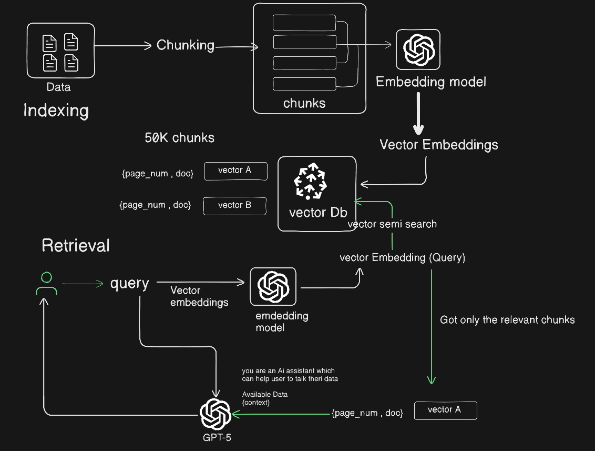

### Naive RAG ARCHITECTURE
------

 

-----

### INDEXING PHASE
- Indexing starts with the cleaning and extraction of raw data in diverse formats like PDF, HTML, Word, and Markdown.
- It is then converted into a uniform plain text format. 
-To accommodate the context limitations of language models, text is segmented into smaller, digestible chunks. 
- Chunks are then encoded into vector representations using an embedding model and stored in vector database. 
- This step is crucial for enabling efficient similarity searches in the subsequent retrieval phase .

----

### RETREIVAL PHASE
---

- Upon receipt of a user query, the RAG system employs the same encoding model utilized during the indexing
phase to transform the query into a vector representation.
- It then computes the similarity scores between the query vector and the vector of chunks within the indexed corpus.
- The system prioritizes and retrieves the top K chunks that demonstrate the greatest similarity to the query. 
- These chunks are subsequently used as the expanded context in prompt.

---

### SYSTEM_PROMPT
---

```
SYSTEM_PROMPT = f"""
You are  helpful AI Assistant who answers user query based on the available context
retrieved from a PDF file along with page_contents and page number.
 
You should only answer the user based on the following context and navigate the user to
open the right page number to know more .
 
context:
{context}
```

-----

### GENEARTION PHASE 
---
- The posed query and selected documents are
synthesized into a coherent prompt to which a large language model is tasked with formulating a response. 
- The model’s approach to answering may vary depending on task-specific criteria, allowing it to either draw upon its inherent parametric
knowledge or restrict its responses to the information contained within the provided documents.

----

### Naive RAG encounters notable drawbacks: 
---

### 1. Retrieval Challenge 
- The retrieval phase often struggles
with precision and recall, leading to the selection of misaligned
or irrelevant chunks, and the missing of crucial information.

### 2.Generation Difficulties. 
- In generating responses, the model may face the issue of hallucination, where it produces content not supported by the retrieved context. This phase can
also suffer from irrelevance, toxicity, or bias in the outputs,
detracting from the quality and reliability of the responses.

