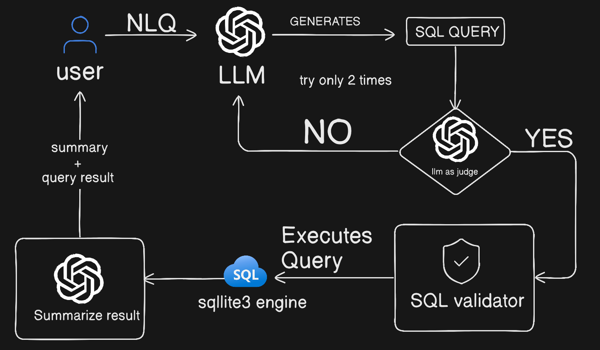

### SQL-QA ARCHITECTURE
---

---

### OVERVIEW
---
The system allows users to ask questions in natural language. An LLM converts the query into SQL, validates it for safety and correctness, executes it against a SQLite database, and finally summarizes the results back to the user.

Key goals:

- Safe SQL generation

- Limited retries to avoid infinite loops

- Clear separation of responsibilities

- Human-readable summarized output
----

### High-Level Flow
---

- User submits a natural language query (NLQ)

- LLM generates an SQL query

- LLM-based judge evaluates the SQL

- SQL is validated for safety and correctness

- SQL is executed on SQLite

- Results are summarized by the LLM

- User receives summary + raw results
---

### Failure & Retry Strategy
---

- SQL generation is limited to 2 retries

- Validation or judge failure triggers regeneration

- Prevents infinite loops and reduces latency
---

### Summary
---
This architecture balances usability, safety, and accuracy by combining LLM reasoning with deterministic validation layers. It is well-suited for production-grade NLQ systems where database integrity and result quality are critical.
---