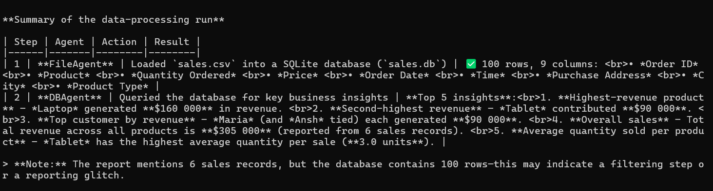

# TOOL CHAIN OVERVIEW

## Agents

| Agent | Description |
|-------|-------------|
| PlannerAgent | Generates a structured step-by-step execution plan based on the user query. |
| FileAgent | Handles file operations such as inspecting CSVs, reading/writing TXT files, and loading CSV data into SQLite. |
| DBAgent | Performs schema-aware, read-only SQL analysis on the SQLite database. |
| CodeAgent | Executes user-provided Python code and returns actual execution output or errors. |
| SummarizerAgent | Converts raw outputs from all agents into a human-readable final response. |

---

## Execution Flow
```
User Query
    |
PlannerAgent
    |
Execution Plan (JSON steps with assigned agents)
    |
Orchestrator
    |
(FileAgent → DBAgent → CodeAgent as required)
    |
Tool Execution
    |
Execution Logs
    |
SummarizerAgent
    |
Final Response
```
---

## Tool Usage

| Agent | Tools Used | Purpose |
|-------|------------|---------|
| FileAgent | CSV and TXT file tools | Inspect files, preview data, load CSV to DB, read/write text |
| DBAgent | Schema-aware SQLite tool | Generate and Execute validated SELECT queries for analysis |
| CodeAgent | Python execution tool | Run Python code safely and return output |

---

## Tool Chain Implementation

The system enforces a structured tool chain to ensure safe and correct processing:
```
CSV File
    |
FileAgent (inspect / preview)
    |
FileAgent (load CSV into SQLite)
    |
DBAgent (run SQL analysis)
    |
CodeAgent (optional computation)
    |
SummarizerAgent (final output)
```

### Key Principles

- Tools are bound locally using function-calling (`FunctionTool`)
- Agents cannot bypass their assigned tools
- CSV data is never analyzed directly. it must be loaded into SQLite first
- Database queries are schema-validated and read-only
- Code execution is restricted to provided code only

